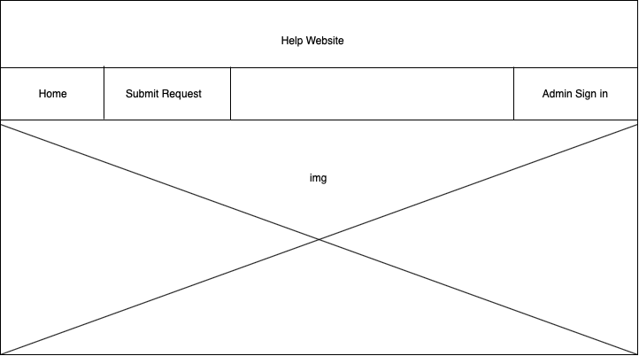
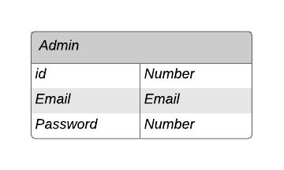

# Help_website

## Overview:

A platform that provide help to families affected by the consequences of the COVID-19  by creating requests for the specialized authorities.

## User Story:
<li>As a User , you can add your information and submit a request.

<li>As a Admin , you can show all requests.
<li>As a Admin , you can edit request. 
<li>As a Admin, you can delete request.
<li>As a Admin, you can export all request to Execl sheet.

## Wireframes :

#### Home Page :

 

#### Submit request page:

 

#### Admin Page :

###### All Request :

 

###### Export Request :

 

## ERD 

### Demo :
https://docs.google.com/presentation/d/1on4RvfTGOlRjoDCCgXO7MaSkCU2JzI8BYHcGgSVCQe4/edit?usp=sharing

## List of technologies used in this project:

<li>Ruby
<li>Rails
<li>CSS

## Help Website Link :
https://help-website-covid-19.herokuapp.com/
